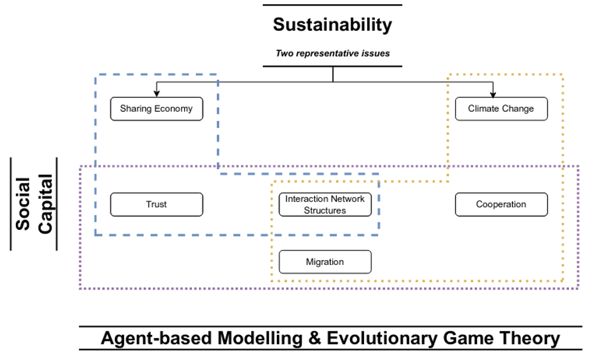

# PhD
## Agent-based modelling of the social dilemma of sustainability.

I have used agent-based modelling (ABM) as a tool to study social dilemmas around different issues, such as sustainabiilty and climate change.
Within these social dilemmas, I have focused on the core ideas of *cooperation* and *trust* as well as the impact of *migration*, *diversity* and *thresholds*
- Cooperation and trust are costly and risky.
- What about the impact of migration and diversity?
- Are there any threholds?

With ABM, I have used [Evolutionary Game Theory (EGT)](https://en.wikipedia.org/wiki/Evolutionary_game_theory) as the theoretical framework, since EGT allows us to illustrate social dilemmas, understand the strategic options available to rational individuals and the interaction of those individuals.

### Publications
- [Dhakal, S., Chiong, R., et al. (2020), Climate change induced migration and the evolution of cooperation.](https://doi.org/https://doi.org/10.1016/j.amc.2020.125090)
- [Chiong, R., Dhakal, S., et al. (2022), Evolution of trust in the sharing economy with fixed provider and consumer roles under different host network structures.](https://doi.org/https://doi.org/10.1016/j.knosys.2021.107496)
- [Dhakal, S., Chiong, R., et al. (2022), Evolution of cooperation and trust in an N-player social dilemma game with tags for migration decisions.](https://doi.org/https://doi.org/10.1098/rsos.212000)
