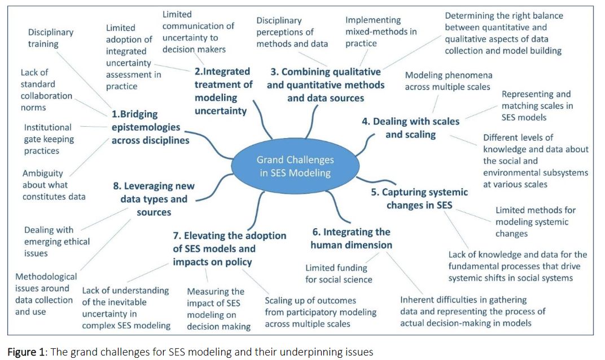

# Opportunities from Big Data
- Use big data to understand how people perceive, use and react to events around them. Big data may provide us with new avenues with which to explore how people perceive, use and react to events in the spaces around them, and the potential to incorporate these observations into our models in near real time.

- Use the improved understanding of the connections between people, organisations and space to support building agent behaviour and their environment. We can also understand more about the connections between people, organisations and space. This can offer a new perspective for constructing artificial worlds, build environment layers, and derive behaviours that motivate agents to make certain choices and take certain actions.

- Determine the most important parameters or factors in a model. Without actually knowing much about the important processes that need to be captured, it is an almost impossible task to build models that are representative of the 'real' world.

- Converting qualitative data into quantitative model parameters and model generalisation from context-specific ethnographic data (such as text, images, videos, audio)

- How to derive insights from data to better inform the basic structures of models, or to calibrate and validate models?

- Use Graph Neural Networks (GNNs) to derive behavioural rules of networked entities, or aggregate and forecast the population-level behaviour patterns?

# Socio-Environmental Systems (SES) Modeling
SES modelling involves developing and/or applying models to investigate complex problems arising from interactions among human (i.e. social, economic) and natural systems [^elsawah2020eight].

SES modelling allows developers and users to systematically explore and assess the interactive effects of changes in controllable (e.g. policy and its instruments) and uncontrollable (e.g. natural and external system influences) drivers on systems of interest.

# Uncertainty in modelling
Uncertainty arises in the various phases of the modelling process, including:

  - defining model purpose and objectives
  - problem framing and model conceptualisation
  - setting up of model structure, parameters and boundary conditions
  - the verification/validation process and uncertainty assessment itself
  - model coding and numerical implementation
  - communication process and modelling workflows used

The most important principle that must become standard practice in SES modelling to overcome this challenge is that uncertainty types and sources need to be identified, prioritised and managed throughout the whole modelling process. Its consideration should begin at the problem defining stage, integrated into the workflow and involve all relevant stakeholders.

## Assumptions
*How to deal with potentially erroneous assumptions?*
- be as explicit with ourselves (and others) about the assumptions we are making about reality, including those which may be taken-for-granted within (and often beyond) our fields, and be as comprehensive as possible [^edmonds2019using].

# Dealing with scales and scaling
Since spatial and temporal domains between social and environmental systems tend not to overlap, they need to be coherently mismatched to allow for coupled modelling.

In representing social processes, the choice of the time horizon and the length of a single time step would significantly affect results. The choice of scale representation is further complicated when models with spatio-temporal mismatch are coupled. For example, social subsystem models are often simplified to annual or seasonal temporal resolutions that differ from the representation of environmental subsystems which are often daily or sub-daily. Models of human behaviour are often designed for the individual or small group scale while many environmental problems are global in nature.

# Integrating the human dimension
Bidirectional feedbacks between the human and natural model subsystems are paramount to reproducing the non-linear dynamics of SES. This implies the mechanisms driving dynamics within each subsystem should be captured in complexity that is sufficient, but at the same time is warranted by the modelling purpose.

# Participatory modelling (PM)
Participatory modelling (PM) is a powerful approach to address SES-related problems, by harnessing the innovative capacity of diverse stakeholders to generate both understanding and novel solutions built on this understanding, and thus strengthening the adaptive capacity of SES. 

# Microsimulation
Microsimulation could be used to give the agents in ABM their initial characteristics and locations while ABM could then provide the capacity to model individual adaptive behaviours and emergence of new behaviours [^ballas2018spatial][^boman2004multi].

[^ballas2018spatial]: [Ballas, D., Broomhead, T., et al. (2018), Spatial microsimulation and agent-based modelling.](https://doi.org/10.1007/978-3-319-89806-3_4/COVER)
[^boman2004multi]: [Boman, M. and Holm, E. (2004), Multi-Agent Systems, Time Geography, and Microsimulations.](https://doi.org/10.1007/1-4020-2370-7_4)
[^elsawah2020eight]: [Elsawah, S., Filatova, T., et al. (2020), Eight grand challenges in socio-environmental systems modeling.](https://doi.org/10.18174/SESMO.2020A16226).
[^edmonds2019using]: [Edmonds, B. and Aodha, L. í. (2019), Using Agent-Based Modelling to Inform Policy – What Could Possibly Go Wrong?.](https://doi.org/10.1007/978-3-030-22270-3_1/FIGURES/6)
