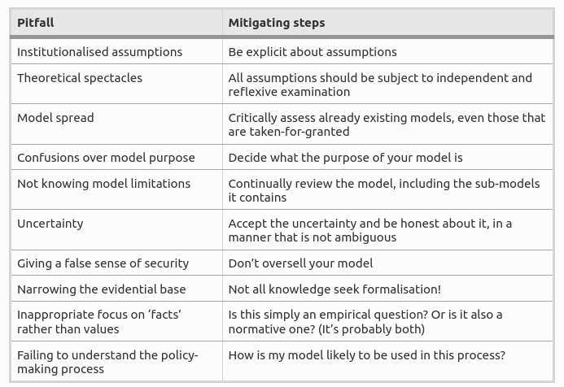

# What is prediction?
*Prediction*: a definition that is understood by policy makers.

> By 'prediction', we mean the ability to **reliably** anticipate well-defined aspects of data that is not currently known to a useful degree of accuracy via computations using the model.

## What sort of prediction
After Edmonds, B., Polhill, G., et al. (2019) [^edmonds2019predicting]

- the prediction has to be unknown at the time of prediction; verification using prediction of something that has happened is not sufficient.
- what is being predicted is *well defined*; predictions that are vague or suggestive are not always useful in practical cases.
- what is being predicted must be useful and verifiable by an independent actor. The prediction could be a probabilistic prediction, a range of values, a negative prediction, etc. - the accuracy of the prediction depends on its use.

- Talk about scenarios and expectations instead of predictions [^deMatosFernandes2020noone], and anticipate the various things that might happen [^edmonds2019using].
- We can update a model with empirical data to increase reliability but it remains a scenario about a future state given an (often expansive) set of assumptions.

*Reflexive possibilistic modelling* [^edmonds2019using] (Find out more)

 Whilst statistical and other methods might make predictions as to policy outcomes, an [agent-based-model](index.md) might provide an accompanying analysis of the ways in which the policy and its impacts may transpire.

> As individuals and collectives, we have some responsibilities for the trajectories the systems take. To take such responsibility seriously, we do need to be able to anticipate the consequence of our actions in a complex world. This is the motivation for considering how ABM could tackle prediction [^polhill2021using].

# Pitfalls
After Edmonds, B. and Aodha, L. í. (2019) [^edmonds2019using]

[^edmonds2019predicting]: [Edmonds, B., Polhill, G., et al. (2019), Predicting Social Systems – a Challenge  Review of Artificial Societies and Social Simulation.](https://rofasss.org/2019/11/04/predicting-social-systems-a-challenge/)
[^edmonds2019using]: [Edmonds, B. and Aodha, L. í. (2019), Using Agent-Based Modelling to Inform Policy – What Could Possibly Go Wrong?.](https://doi.org/10.1007/978-3-030-22270-3_1/FIGURES/6)
[^polhill2021using]: [Polhill, J. G., Hare, M. P., et al. (2021), Using Agent-Based Models for Prediction in Complex and Wicked Systems.](https://doi.org/10.18564/JASSS.4597)
[^deMatosFernandes2020noone]: [Fernandes, C. A. . M. and Keijzer, M. A. (2020), No one can predict the future: More than a semantic dispute  Review of Artificial Societies and Social Simulation.](https://rofasss.org/2020/04/15/no-one-can-predict-the-future/)
