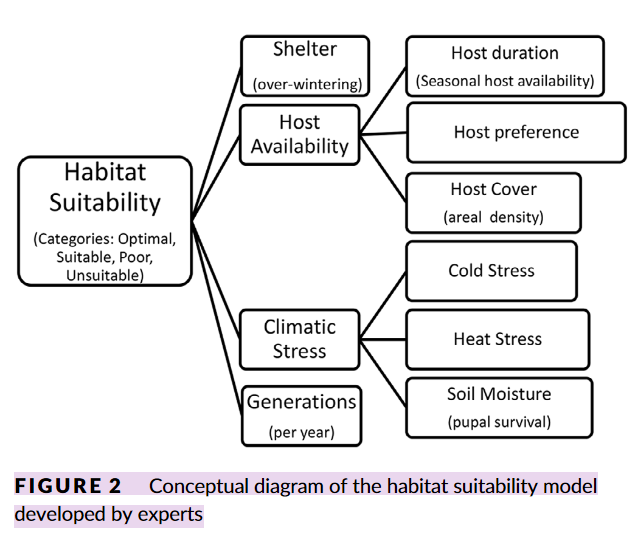

# Queensland Fruit Fly (B. tryoni)

## Existing Models of Qfly

### Habitat Suitability 
Klinken, R. D. ., Murray, J. V., et al. (2019) [^vanklinken2019scale] developed a habitat suitability model for the three premier fruit growing regions in south-east Australia in order to support the development of AWM for the fruit fly pest, B. tryoni.

- using ecological understanding of how *B. tryoni* populatiosn persist throughout the year in the absence of net long distance dispersal and any management activities.

One of the most commonly used tools for ecological modelling are habitat suitability models that identify where populatiosn can persist. The models required for ABM need to be applied regionally while retaining high spatial resolution. This is somewhat lacking in the literature.

Previous models have identified movement as a key behavioural attribute that needs to be captured for accurate model prediction.

Sensitivity analysis showed that:

- habitat suitability was most sensitive to host availability and that shelter had little effect.
- host availability was similarly influenced by host preference, host duration and host cover.
- with climatic stress, heat stress was the most influential.

There was some uncertainty among experts regarding the relative importance of aspects of host suitability on population dynamics. In our model, this mostly affected whether habitats were categorised as optimal or suitable. These relationships are likely to become more critical when modelling population dynamics.

## Movement
Movement of *B. tryoni* in real landscapes remains poorly understood, as it is for most insects. There is evidence that *B. tryoni* can naturally disperse long distances (24-94km), but the general consensus among experts was that population dynamics at a site would be largely determined by flies that occur within about a 200m radius. This conclusion was based on analyses of insect release studies, as well as anecdotal observations that suggest successful management of *B. tryoni* on a farm can largely be achieved through good on-farm management.

[^vanklinken2019scale]: [Klinken, R. D. ., Murray, J. V., et al. (2019), Scale-appropriate spatial modelling to support area-wide management of a polyphagous fruit fly (Diptera: Tephritidae).](https://doi.org/10.1111/AAB.12548)
